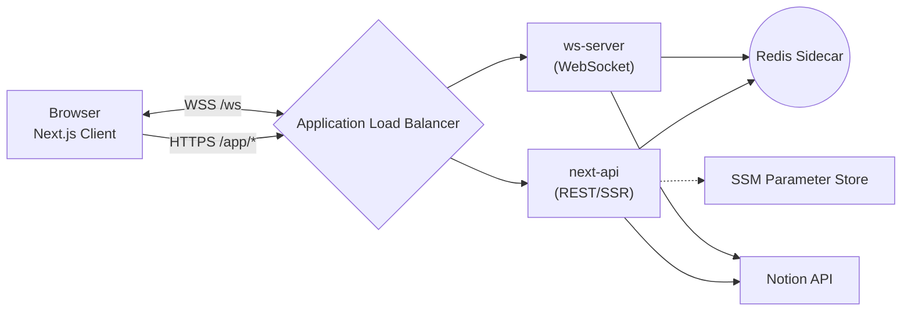
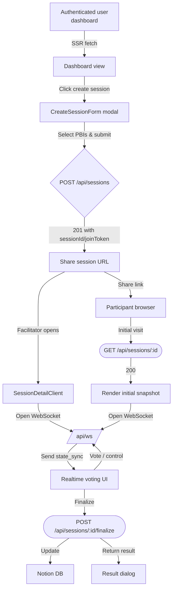

# Fire Pocker システム詳細ドキュメント

## 1. 目的
- 本書は Fire Pocker の現行実装を、アプリケーション構造・リアルタイム制御・外部連携・インフラ観点から統合的に説明する。
- 開発メンバーがコードリーディングなしに全体像を把握し、追加開発や運用設計の判断材料とすることを意図する。

## 2. 全体アーキテクチャ
- **クライアント**: Next.js 14 (App Router) を用いた React アプリ。ブラウザでは React Query と Zustand がデータ取得とリアルタイム状態を担う。
- **サーバー**: Next.js の API Route/Route Handler (`app/api/*`) が REST と SSR を提供し、`pages/api/ws.ts` が WebSocket を処理する。
- **セッションストア**: `src/server/session/store.ts` による Redis。`session:{id}` と `session:token:{token}` を 24 時間 TTL で保持する。
- **外部サービス**: Notion API から PBI 情報を取得・更新。Secrets は SSM Parameter Store で管理する想定。
- **ホスティング**: ALB → ECS Fargate 上で `next-api`・`ws-server`・`redis` コンテナを同居。静的アセットは S3 + CloudFront。

## 3. フロントエンド構成 (Next.js)
- `app/(authenticated)/dashboard` と `app/(authenticated)/session/[sessionId]` が主要ページ。ページ初期化時に Route Handler を介した SSR で初期データを取得する。
- `src/components/providers/ReactQueryProvider.tsx` が React Query をラップし、キャッシュキーは `['pbis']`, `['session', sessionId]` 等。
- リアルタイム状態は `src/store/sessionRealtime.ts` の Zustand ストアが保持し、`useRealtimeSession` フックで WebSocket との仲介を行う。
- ドメイン型は `src/domain/session.ts`・`src/domain/pbi.ts` に定義し、UI/サーバー双方で共有。

## 4. WebSocket チャネル
- `pages/api/ws.ts` が Upgrade をハンドリングし、接続ごとに `server.websocketSessions` マップでセッション ID → 接続集合を管理。
- 接続時に `sessionId` と `token` を必須とし、`getSessionRecord` と `getSessionJoinToken` で検証。拒否時は 4404/4403 の Close Code を返す。
- 受信イベントは `RealtimeEnvelope` (`src/client/realtime/types.ts`) で表現され、以下をサポート。
  - `vote_cast` : 投票値を `updateSessionState` で更新し、フェーズが `READY` の場合は `VOTING` に遷移。
  - `pbi_add` / `pbi_remove` / `pbi_set_active` : `updateSessionPbis` と `selectActivePbi` が Redis 状態と Notion モデルを更新。
  - `reveal_request` : フェーズを `REVEAL` に切り替え。
  - `reset_votes` : 票を初期化し `VOTING` に戻す。
  - `finalize_point` : `finalizeSession` が Notion 更新とフェーズ最終化を実行。
- イベント処理後は常に `broadcastState` で最新 `state_sync` を全接続に送信。失敗時は `event: 'error'` を返す。

## 5. セッションストア / ドメイン
- `SessionState` は `meta`・`phase`・`votes`・`participants`・`activePbiId` で構成 (`src/domain/session.ts`)。
- Redis への永続は `upsertSession` が `SESSION_TTL_MS=24h` の PX オプション付き SET を行い、`joinToken` マップも同時書き込み。
- `cleanupExpired` が `expiresAt` と TTL を二重に確認し、期限切れ時は `removeSession` でキーを削除。
- `updateSessionState` は楽観的に状態を取得 → reducer 適用 → TTL をリフレッシュしながら書き戻す。`listSessions` はすべてのセッションキーを走査し、有効なものだけ返す。

## 6. Notion 連携
- `src/server/notion/config.ts` が `.env` から `NOTION_TOKEN`, `NOTION_PBI_DB_ID` 等を検証し、欠落時はモックにフォールバック。
- `src/server/notion/client.ts` は `USE_REDIS_MOCK` と同様にモッククライアントを返す構成になっており、本番では Notion SDK 呼び出しに置き換える。
- `src/server/pbi/service.ts` が PBI 取得ロジックをまとめ、`findPbi`, `listPbis`, `listSimilarPbis` を提供。WebSocket/REST 双方が共通利用する。

## 7. REST API サーフェス
| メソッド | パス | 概要 | 主な実装ファイル |
| --- | --- | --- | --- |
| POST | `/api/sessions` | セッション作成。`createSession` を呼び出し Redis に初期状態登録。 | `app/api/sessions/route.ts` |
| GET | `/api/sessions/[id]` | セッション状態取得 (フォールバック/SSR)。 | `app/api/sessions/[sessionId]/route.ts` |
| POST | `/api/sessions/[id]/participants` | 参加者登録。`registerParticipant` が Redis を更新。 | 同上ディレクトリ |
| POST | `/api/sessions/[id]/finalize` | Notion へ書き戻し、結果を返却。 | `app/api/sessions/[sessionId]/finalize/route.ts` |
| GET | `/api/pbis` | PBI 一覧検索 (モック)。 | `app/api/pbis/route.ts` |
| GET | `/api/pbis/by-points` | ストーリーポイント単位で PBI を取得。 | `app/api/pbis/by-points/route.ts` |

- すべての Route Handler は `HttpError` (`src/server/http/error.ts`) でエラーを統一し、`code`/`message`/`retryable` をレスポンスする。

## 8. 代表的なデータフロー
1. **セッション作成**
   1. Dashboard から POST `/api/sessions`。
   2. `createSession` が `sessionId` と `joinToken` を生成し、ファシリテーターを参加者リストに追加。
   3. Redis に TTL 付きで保存し、レスポンスで `state` と `joinToken` を返す。
2. **入室**
   1. 参加 URL からページ表示、Route Handler が HTTP で初期 `SessionState` を取得。
   2. クライアントが WebSocket `/api/ws?sessionId=...&token=...` へ接続。
   3. サーバーが token を照合し、直ちに `state_sync` を push。
3. **投票**
   1. `FibonacciPanel` がカード選択 → `vote_cast` を送信。
   2. `updateSessionState` が `votes[userId]=point` に更新し、フェーズを `VOTING` に。
   3. `state_sync` がブロードキャストされ UI が再描画。
4. **確定**
   1. ファシリテーターが `finalize_point` を送信。
   2. `finalizeSession` がフェーズを `FINALIZED` に更新し Notion API (`updateStoryPoint`) を呼び出す。
   3. レスポンス返却後に `finalized` 相当の情報を含む `state_sync` が配信。
   4. 成功後はセッション TTL が延長されるが、`finalizeSession` 実行時に別途削除は行わない (将来の自動クリアは `cleanupExpired` に委譲)。

## 9. データモデルとキー
| キー | 型 | 用途 |
| --- | --- | --- |
| `session:{id}` | JSON (SessionRecord) | セッション状態 + `expiresAt` + `joinToken` |
| `session:token:{token}` | 文字列 | joinToken → sessionId の逆引き |
| SessionRecord | `{ state: SessionState; joinToken: string; expiresAt: number }` | TTL をコード側で制御するメタ情報 |

- Redis の TTL と `expiresAt` の二重管理により、Redis 自体の期限切れとコード上の整合性を担保。`cleanupExpired` が読み込み時に `removeSession` を呼ぶ。

## 10. デプロイ・インフラ
- **ECS タスク**: `next-api`, `ws-server`, `redis` を 1 タスクに収容。標準設定は CPU 0.25/0.25/0.125 vCPU, メモリ 512/512/256 MB。
- **ネットワーク**: ALB Public Subnet → ECS Private Subnet。Redis は localhost のみ公開 (security group 制限)。
- **CI/CD**: Terraform モジュールで ALB, ECS, IAM, CloudWatch を管理予定 (`spec/system_design.md` 参照)。GitHub Actions から `ecs deploy` を行う想定。
- **静的アセット**: build した `.next/static` を S3 に同期し、CloudFront でキャッシュ。

## 11. 運用・監視
- CloudWatch Logs に構造化ログ (JSON) を送信。`ws-server` は接続イベント・エラーを `console.info/error` で出力する。
- 主要メトリクス:
  - ALB 5xx 比率
  - ECS CPU/メモリ使用率
  - Redis Memory/Connected Clients (`INFO` 取得用スクリプトを CloudWatch Agent に設定予定)
  - WebSocket 接続数 (アプリ側でカスタムメトリクス送信)
- アラート条件例: WebSocket 接続失敗率 5% 超 (5 分平均), Notion API 失敗連続 5 回, Redis メモリ 80% 超。

## 12. セキュリティ
- ALB で HTTPS/WSS を終端し、HTTP は HTTPS へリダイレクト。
- `joinToken` は `generateJoinToken` のランダム文字列で、Redis にのみ保存。トークン照合は WebSocket/REST で共通ロジックを使用。
- 環境変数は `.env.local` (開発) または SSM Parameter Store (本番) から読み、`src/server/notion/config.ts` が必須値を検証。
- Redis は外部公開せず、必要なら `requirepass` を設定してサーバー内通信でも保護。

## 13. ローカル開発手順
1. `pnpm install` → `pnpm dev` で Next.js を起動。
2. Redis を用意できない場合は `.env.local` に `USE_REDIS_MOCK=true` を設定。実 Redis を使う場合は `docker compose -f docker-compose.redis.yml up -d`。
3. Notion 連携は `.env.local` に `NOTION_TOKEN`, `NOTION_PBI_DB_ID` 等を設定し、対象 DB をインテグレーションに共有。
4. WebSocket 接続は `http://localhost:3000/session/{id}` から確認。ブラウザコンソールで `ws connection accepted` ログを参照。

## 14. 将来拡張の検討事項
- WebSocket と REST のコンテナ分離 (スケール性向上) や、AppSync/Socket.IO クラスタへの移行検討。
- Redis のマネージド化 (Amazon ElastiCache) + パーシスタンス導入による可用性強化。
- セッション履歴の永続化 (RDS/DynamoDB) とダッシュボードでの可視化。
- OAuth2/OIDC 認証プロバイダ導入と `joinToken` の短期化。
- Observability 強化: OpenTelemetry Exporter を導入して分散トレースを外部 SaaS へ送信。

## 15. 画面フロー

- ダッシュボードは SSR で最新の PBI リストやセッション履歴を表示し、React Query がクライアント側更新を担う。
- セッション作成完了後は joinToken 含む URL を提示し、同 URL 経由で参加者がセッション詳細画面へ遷移する。
- セッション詳細 (`SessionDetailClient`) は初回ロード時に HTTP スナップショットを取得したうえで WebSocket を確立し、`state_sync` イベントで UI を更新する。
- 投票やフェーズ操作は WebSocket を通じて即座に反映され、確定時は REST エンドポイントを経由して Notion に書き戻される。

---
更新日: 2025-10-23 / 作成者: Fire Pocker チーム
