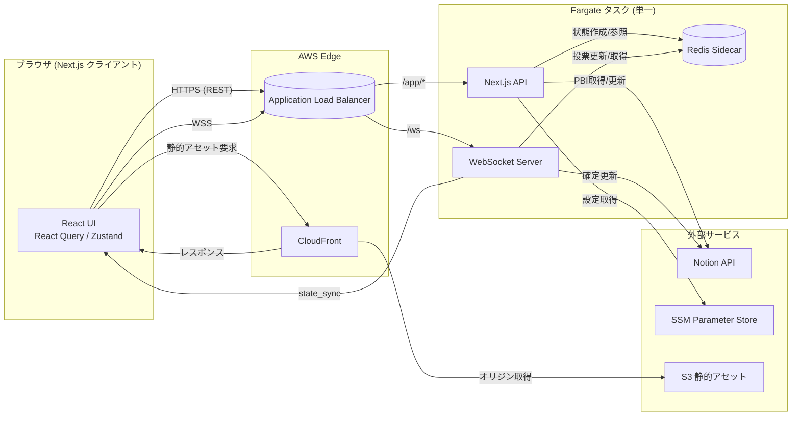

# Fire Pocker システム設計書

## 1. 目的と範囲
- 本書は Fire Pocker の実装に向けた詳細なシステム設計を記述する。
- 対象範囲はフロントエンド (Next.js App Router)、リアルタイム WebSocket サーバー、Redis サイドカー、Notion 連携、および AWS 上のインフラ構成と運用要件。
- 仕様の基盤は `spec/fire_pocker_spec.md` と ADR (特に 0001, 0002) を参照とし、ここでは実装レベルに落とし込む。

## 2. 全体アーキテクチャ概要
- **単一 Fargate タスク構成**  
  - コンテナ: `next-api` (App Router/REST API), `ws-server` (リアルタイム), `redis` (インメモリサイドカー)。  
  - ALB (HTTPS/WebSocket) が `/app/*` を `next-api`、`/ws` を `ws-server` にルーティング。静的アセットは S3 + CloudFront。
- **データフロー**  
  1. Next.js が Notion API から PBI 情報を取得し表示。  
  2. WebSocket でセッション/投票イベントを Redis に書き込み、参加者へ配信。  
  3. `finalize_point` で Notion API に結果を書き戻し、Redis から該当セッション情報を削除。  
  4. Redis は揮発性 (永続化なし) のため、タスク再起動後は Notion/PBI リストから状態再構築。
- **外部サービス**: Notion API、AWS SSM Parameter Store、CloudWatch、SNS (アラート)。

## 3. フロントエンド設計 (Next.js App Router, Feature-based)

### 3.1 ディレクトリ構成
```
app/
  layout.tsx / template.tsx
  (marketing)/...
  (authenticated)/
    dashboard/
      page.tsx                 # セッション一覧 & 過去履歴
      components/
        SessionCard.tsx
        SessionStatusBadge.tsx
      hooks/
        useFetchSessions.ts
    session/
      [sessionId]/
        page.tsx
        loading.tsx
        components/
          PbiDetailsPanel.tsx
          FibonacciCards.tsx
          VoteSummary.tsx
          SimilarPbiPanel.tsx
        hooks/
          useRealtimeSession.ts  # WebSocket + Zustand
          useReveal.ts
          useFinalizePoint.ts
        actions/
          finalizeSession.ts     # Route handler 経由で Notion 更新
    settings/
      page.tsx / route.ts
shared/
  components/ (Button, Modal, Toast など)
  hooks/      (useAuthGuard, useToast)
  lib/
    notionClient.ts
    fetcher.ts
  store/      (Zustand slices, e.g. authSlice, uiSlice)
  utils/      (type guards, formatters)
types/
  session.ts, pbis.ts
```
- App Router のセグメント `(authenticated)` には Layout で認証済み UX を提供。`generateMetadata` など SEO 設定もここで統一。
- Feature 単位で `components`, `hooks`, `actions`, `types` を内包し、横断的な utilities は `shared` 配下へ。

### 3.2 データフェッチ戦略
- React Query + Route Handlers。
  - `GET /api/pbis` → `useQuery(['pbis', filters])`。
  - SSR 必須ページ (例: dashboard) は `fetch` with `cache: 'no-store'` + React Query の `dehydrate` を活用。
- クライアント・サーバー両方で Notion Secret を扱わないため、Route Handler 経由で Notion SDK を呼び出す。

### 3.3 状態管理
- **Zustand**: WebSocket セッション状態 (`votes`, `participants`, `phase`, `lastNonce`) や UI フラグを保持。
- **React Query**: Notion 由来のリスト/詳細データ。
- **Context**: 最小限 (テーマ、トーストなど)。

### 3.4 UI/UX ポイント
- フィボナッチカードはキーボード操作に対応 (`role="radio"`, Arrow navigation)。
- 類似 PBI パネルは `useQuery` で遅延取得、結果が無い場合はガイドリンクを表示。
- モバイルは縦スクロールレイアウト、タブレット以上で 2 カラム (PBI 詳細 + 投票/履歴)。

## 4. WebSocket サーバー設計
- ランタイム: Node.js 20, フレームワーク: Fastify + `@fastify/websocket` または Express + `ws`。  
- エンドポイント: `wss://<domain>/ws?sessionId=xxx&token=yyy`
- 認証:
  - 初回接続時に署名付き `joinToken` を検証。期限切れは拒否 (`closeCode 4003`)。
  - 認証結果を Redis `session:{id}:participants` に登録。
- イベント処理パイプライン:
  1. 受信 → JSON schema (Zod) でバリデーション。
  2. `nonce`/`version` チェックでリプレイ防止。
  3. `Redis WATCH/MULTI` で楽観ロックし状態更新。
  4. 成功時に参加者全員に `state_sync`／必要に応じた `vote_ack` 等送信。
- フェールセーフ:
  - Redis 障害時は `error` イベントでクライアントへ通知し、再接続を促す。
  - タスク再起動時のセッション復帰は、クライアントが `state_sync` を要求 → Route Handler 経由で Notion から最新データを取得。

## 5. Redis データモデル (揮発性)
| キー | 用途 | 構造 | TTL |
| --- | --- | --- | --- |
| `session:{id}:meta` | PBI メタ情報, facilitator | Hash `{title, facilitatorId, createdAt}` | 24h |
| `session:{id}:votes` | 投票値 | Hash `{userId: point}` | 24h |
| `session:{id}:participants` | 接続中ユーザー一覧 | Set | 24h |
| `session:{id}:phase` | 状態 (`READY`, `VOTING`, `REVEAL`, `FINALIZED`) | String | 24h |
| `session:{id}:history` | 投票履歴 (開示後) | List of JSON | 24h |
| `stream:sessions` | 状態変更イベント | Redis Stream | 24h |
- `reset_votes` 時は `votes`, `phase`, `history` をまとめて削除または初期化。
- `finalize_point` 後は Notion 更新成功を確認してから全キーを削除 (`DEL session:{id}:*`)。

## 6. Notion 連携設計
- SDK: `@notionhq/client`。Lambda ではなく Next.js Route Handler (Node runtime) 内で使用。
- データマッピング:
  - `PBI一覧DB`: `Title`, `Status`, `StoryPoint`, `Assignee`, `Epic`, `LastEstimatedAt`.
  - `PBI管理DB`: `PBI` (Relation), `SessionDate`, `FinalPoint`, `Facilitator`, `Notes`.
- API ラップ層:
  - `lib/notionClient.ts`: 共通クライアント生成。
  - `repositories/pbiRepository.ts`: CRUD (クエリ、更新)。
  - エラーハンドリング: レート制限時は 429 で待機 (指数バックオフ)。
- 失敗時リカバリ:
  - `finalize_point` が Notion 更新に失敗 → Redis Stream にイベント記録 → バックグラウンドワーカーがリトライ通知。

## 7. インフラ構成

### 7.1 リソース
- **VPC**: Public/Private サブネット。Fargate は Private サブネット + NAT 経由で外部アクセス。
- **ALB**:
  - HTTPSリスナー (443): `/ws` → `ws-target-group` (port 8081)、それ以外 → `next-target-group` (port 8080)。
  - 健康チェック: `GET /healthz` (Next.js), `/ws/healthz` (WebSocket server の HTTP ping)。
- **ECS Fargate サービス**:
  - タスク定義: 
    - `next-api`: port 8080, CPU 0.25 vCPU, Memory 512MB。
    - `ws-server`: port 8081, CPU 0.25 vCPU, Memory 512MB。
    - `redis`: port 6379, CPU 0.125 vCPU, Memory 256MB, `appendonly no`, `save ""`。
  - サービス: 最小 2 タスク (HA)。必要に応じて `desiredCount=1` でコスト削減可能。
- **その他**: S3 (静的アセット), CloudFront, ECR, SSM Parameter Store, CloudWatch Logs/Alarms, SNS。

### 7.2 IaC
- Terraform モジュールを `infra/modules/{alb,ecs-task,security,observability}` で分割。
- コンテナ設定は `aws_ecs_task_definition` の `container_definitions` に JSON で登録。Redis は `dependsOn` で最初に起動。
- Secrets: Parameter Store の参照 (`NOTION_TOKEN`, `SESSION_JOIN_SECRET`, `REDIS_PASSWORD` optional)。

## 8. 運用・監視
- **メトリクス**: ALB リクエスト数/5xx、ECS CPU/メモリ、Redis メモリ・接続数、WebSocket 接続数 (アプリ側から CloudWatch EMF)。
- **ログ**: 各コンテナを CloudWatch Logs にストリーム。構造化 (JSON) ログを推奨。
- **アラート**:
  - 接続失敗率 > 5% (5 分平均)。
  - Redis メモリ使用率 > 80%。
  - Notion API エラー連続 5 回。
- **バックアップ**: データは Notion 側に集約されるため、Redis バックアップ無し。アプリ構成のバックアップは Terraform state + ECR。

## 9. セキュリティ
- HTTPS/WSS 強制。ALB → ECS は Private サブネット + セキュリティグループで制限。
- `joinToken` は HMAC-SHA256 サイン。短寿命 (例: 30 分)。
- Redis はローカルネットワーク内のみ公開 (127.0.0.1)、認証オプションを設定しておく。
- CI/CD IAM ロールは最小権限 (ECR push, ECS update-service, S3 sync)。

## 10. API 定義

### 10.1 HTTP API
| エンドポイント | メソッド | 認証 | リクエスト主要フィールド | レスポンス例 | ステータス | 備考 |
| --- | --- | --- | --- | --- | --- | --- |
| `/api/pbis` | GET | `x-session-secret` | `status?`, `search?` | `{ items: PBI[], nextCursor? }` | 200, 401, 500 | PBI一覧DB をフィルタリング |
| `/api/pbis/{id}/similar` | GET | `x-session-secret` | Path: `id` | `{ items: SimilarPBI[] }` | 200, 404, 500 | 同一 StoryPoint の履歴取得 |
| `/api/sessions` | POST | `x-session-secret` | `{ title, facilitator, pbiIds[] }` | `{ sessionId, joinToken }` | 201, 400, 401, 500 | Redis にセッション作成 |
| `/api/sessions/{sessionId}` | GET | `Authorization: Bearer <joinToken>` | - | `{ meta, votes, participants, phase }` | 200, 401, 404 | HTTP フォールバック用 |
| `/api/sessions/{sessionId}/finalize` | POST | `Authorization: Bearer <joinToken>` | `{ finalPoint, memo? }` | `{ status: 'ok' }` | 200, 400, 401, 409, 500 | Notion 更新後に Redis 削除 |

### 10.2 WebSocket イベント
共通フィールド: `sessionId`, `event`, `payload`, `version`, `nonce`

| イベント | 方向 | ペイロード例 | 説明 |
| --- | --- | --- | --- |
| `state_sync` | サーバー → クライアント | `{ state, votes, participants, lastUpdatedAt }` | 最新スナップショット |
| `vote_cast` | クライアント → サーバー | `{ userId, point }` | 投票要求 |
| `vote_ack` | サーバー → 送信者 | `{ userId, point, accepted: true }` | 投票結果通知 |
| `reveal_request` | 任意クライアント → サーバー | `{ userId }` | 集計開示 |
| `reset_votes` | 任意クライアント → サーバー | `{ userId }` | 投票初期化 |
| `finalize_point` | 任意クライアント → サーバー | `{ userId, finalPoint, memo? }` | 合意ポイント確定要求 |
| `finalized` | サーバー → 全クライアント | `{ finalPoint, notionPageId, updatedAt }` | Notion 更新完了通知 |
| `error` | サーバー → クライアント | `{ code, message, retryable }` | エラー共通形式 |

### 10.3 エラーコード
- HTTP も WebSocket も `{ code, message, retryable }` を返却。
- 主な `code`: `ValidationError`, `Unauthorized`, `Conflict`, `NotionError`, `InternalError`.

### 10.4 DFD (フロント/バック/Redis)



## 11. シーケンス例

### 11.1 セッション作成
1. Facilitator が UI から対象 PBI を選択 → `POST /api/sessions`.
2. Next.js API が Notion から詳細を取得し検証 → Redis に `session:{id}:meta` を保存。
3. `joinToken` を発行し UI に返却。

### 11.2 投票・開示
1. 参加者が WebSocket 接続 (`sessionId`, `joinToken`)。
2. `vote_cast` イベント → Redis `votes` に反映 → `vote_ack` + `state_sync` を Broadcast。
3. `reveal_request` → 状態を `REVEAL` に更新 → 各ユーザーの投票結果を `state_sync`。

### 11.3 確定・Notion 更新
1. Facilitator が `finalize_point` → Redis で `phase=FINALIZED`、`history` に格納。
2. WebSocket サーバーが Notion API 更新 (PBI一覧DB, PBI管理DB)。
3. 成功時に `finalized` イベント送信 & Redis エントリ削除。失敗時は Redis Stream に残し再試行。

## 12. スケーラビリティと将来計画
- **タスク分割条件**: 1 タスクあたり WebSocket 接続が 500 を超える / CPU 使用率 70% 超が 5 分継続 → WebSocket と Next.js を別サービスに分割。
- **フォールバック**: WebSocket 不可環境向けに HTTP ポーリング API (`GET /api/sessions/{id}/state`) を提供。
- **拡張余地**: OAuth2 認証、セッション履歴の永続化 (RDS 追加)、AppSync / EventBridge への移行など。

## 13. ロックイン回避要素
- コンテナベースのため他クラウドのコンテナランタイムへ移行可能。
- Redis サイドカーは OSS イメージ (Bitnami/Redis 等) を採用し、設定は Helm/Compose にも転用可。
- WebSocket メッセージ/リポジトリを TypeScript interface で定義し、インフラ差し替え時もコアロジックを変更しない。
- Terraform モジュールはプロバイダー依存の部分を分離し、Pulumi 等への移行を容易にする。

---
作成者: Fire Pocker チーム  
更新履歴: 初版 (2024-05-20)
